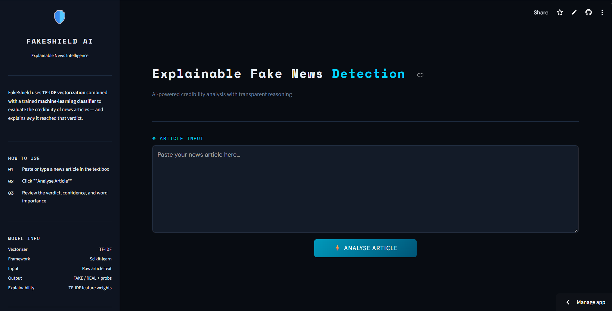
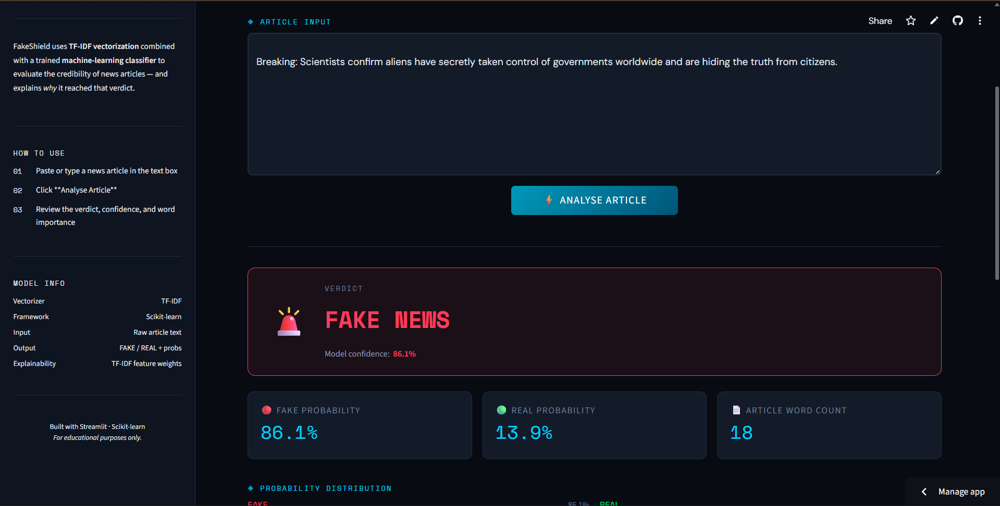
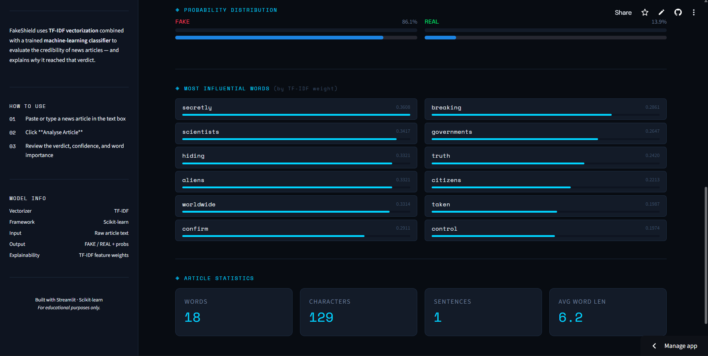

# 🛡️ FakeShield AI — Explainable Fake News Detection Dashboard

> An end-to-end NLP + Machine Learning application that predicts news credibility, displays confidence scores, and explains its decisions through keyword-level interpretability — deployed on Streamlit Community Cloud.

[](https://fake-news-detection-ai-dashboard-cbz992teuhkjpctskshcnp.streamlit.app/)
[](https://python.org)
[](https://scikit-learn.org)
[](LICENSE)

---

## 📌 Overview

**FakeShield AI** is a production-style machine learning application built to detect misinformation in news articles. It goes beyond a basic classifier — it surfaces *why* it made a decision, making it an **Explainable AI (XAI)** system suitable for real-world trust and transparency requirements.

The classifier is trained on approximately **44,000 labeled news articles** from the Kaggle Fake and Real News Dataset, enabling robust credibility detection across diverse political and media writing styles.

This project showcases a complete ML workflow:

raw text → preprocessing → TF-IDF feature engineering → classification → probability-calibrated output → interactive dashboard deployment

---

## 🌐 Live Demo

**▶ Try FakeShield AI**

https://fake-news-detection-ai-dashboard-cbz992teuhkjpctskshcnp.streamlit.app/

---

## 📷 Screenshots

(Add screenshots inside `/screenshots` folder after capturing UI images)

### Dashboard Interface



### Prediction Example



### Explainability Panel



---

## 🧠 Features

| Feature                    | Details                                           |
| -------------------------- | ------------------------------------------------- |
| ✅ Binary classification    | FAKE or REAL news prediction                      |
| ✅ Confidence scoring       | Probability of winning class displayed            |
| ✅ Probability distribution | Both FAKE and REAL probabilities shown            |
| ✅ Keyword explainability   | Top influential words using TF-IDF weights        |
| ✅ Model compatibility      | Supports predict_proba + decision_function models |
| ✅ Article statistics       | Word count, character count, sentence estimate    |
| ✅ Dark analytics dashboard | Structured Streamlit UI                           |
| ✅ Cloud deployment         | Hosted on Streamlit Community Cloud               |

---

## 🧪 Example

**Input**

Breaking: Scientists confirm aliens have secretly taken control of governments worldwide.

**Output**

Verdict: FAKE NEWS
Confidence: 83.7%

Fake Prob: 83.7%
Real Prob: 16.3%

Top Influential Words:

secretly
aliens
confirm
scientists
governments

---

## 🛠️ Tech Stack

| Layer               | Technology                |
| ------------------- | ------------------------- |
| Language            | Python 3.9+               |
| ML Framework        | Scikit-learn              |
| Model               | LinearSVC                 |
| Feature Engineering | TF-IDF Vectorization      |
| Data Handling       | Pandas, NumPy             |
| Model Persistence   | Joblib                    |
| Dashboard           | Streamlit                 |
| Deployment          | Streamlit Community Cloud |

---

## 📂 Project Structure

```
fake-news-detection-ai-dashboard/
│
├── app.py
├── requirements.txt
├── README.md
│
├── models/
│   ├── model.pkl
│   └── vectorizer.pkl
│
└── src/
    ├── predict.py
    ├── preprocessing.py
    └── train_models.py
```

---

## ⚙️ How It Works

User inputs article text

↓

Text preprocessing

↓

TF-IDF vectorization

↓

LinearSVC classifier prediction

↓

Probability extraction

↓

Keyword importance extraction

↓

Dashboard visualization

---

## 📊 Dataset

Fake and Real News Dataset (Kaggle)

https://www.kaggle.com/datasets/clmentbisaillon/fake-and-real-news-dataset

Contains:

~44,000 labeled news articles
Two classes: Fake and True

Sources include PolitiFact and verified news outlets.

---

## 🚀 Run Locally

Clone repository

```
git clone https://github.com/ramya63822/fake-news-detection-ai-dashboard.git
cd fake-news-detection-ai-dashboard
```

Install dependencies

```
pip install -r requirements.txt
```

Launch application

```
streamlit run app.py
```

Dashboard opens at:

http://localhost:8501

---

## 🔑 Key Implementation Details

### Explainability via TF-IDF weights

Instead of relying on heavy external explainability frameworks like SHAP or LIME, the system extracts the top 15 TF-IDF-weighted features from the transformed document vector to highlight influential keywords driving predictions. This keeps inference lightweight and fast while maintaining transparency.

### LinearSVC compatibility

LinearSVC does not implement predict_proba. The prediction module detects this automatically and applies a sigmoid transformation to decision_function output, generating probability-like confidence scores without retraining the model.

---

## 📈 Future Improvements

* BERT / DistilBERT deep learning classifier
* SHAP explainability visualization
* Source credibility scoring
* REST API using FastAPI
* Multi-language support

---

## 👩‍💻 Author

**Ramya Sree**

GitHub:

https://github.com/ramya63822

---

## ⭐ If you found this useful

Consider starring the repository ⭐
